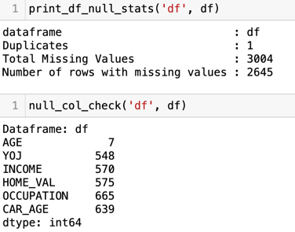

# Claim Prediction 

## Objective

The objective of this project is to identify effective way if the claim is occured by identifying and evaluating the best possible classifer model. We will be training, tuning and validatin the 3 binary classifier to accurately classify given data set. Then the 3 models will compared to identify the best one. Using this classification problem further insight and model can be created to solve another ML regression problem of identifying the claim amount given cliam is raised.

## DATA
The dataset contains information on policyholders of motor insurance such as the type of vehicle, vehicle value, household statistics, claim history etc.
Data has been sourced from kaggle - 
https://www.kaggle.com/datasets/xiaomengsun/car-insurance-claim-data

Data contain 10302 rows and 27 columns.

Columns are mix of Number (Int and Float) and Categories. Data is not clean data and contain missing value and null.

!

Data set was randomly divided into Training and Test datasets.

## Machine Learning problem

The aim of this project was to answer classification problem - **_if a claim occured for given data set_**

## MODEL 
Model selection was based of the experiments done on the various classification models. In the initial run various models like *Logistic Regression*, *K Neighbors Classifier*, *Naive Bayes*, *Random Forest* were trained and validated on the base model configurayion. Based on the performance metrics *XGBClassifier*, *GradientBoostingClassifier* and *LogisticRegression* were choosed for further analysis and hyper parameyer tuning. 

Base Model performance can be seen in the below

## HYPERPARAMETER OPTIMSATION
Various technique were used to optimise the hyper parameter. GridSeachCV from sklearn library was employed and provide the best parameter. Along with this Cross validation was done using **StratifiedKFold** from sklearn library.
This cross-validation object is a variation of KFold that returns stratified folds. The folds are made by preserving the percentage of samples for each class.

### LogisticRegression
Following hyperparameter were investigated to optimise the model. 
- C (regularization): Model performance was measured for range of C value. 
- solver: various solver available were tried to {‘lbfgs’, ‘liblinear’, ‘newton-cg’, ‘newton-cholesky’, ‘sag’, ‘saga’} to see if there any performance benefit
- Penalty: None and l2

### GradientBoostingClassifier
Following hyperparameter were investigated to optimise the model.
- learning_rates: Best learning was found at 0.1
- n_estimators: Best estimator was found at 100 
- max_depths: 3
- min_samples_splits: didn't provide any improvement
- min_samples_leafs:  didn't provide any improvement
- max_features: 5

Along with these hyper parameters GridSeachCV was used which provide similar best parameter.

one of the plot as below used for hyper parameter tuning and finding best value. 

### XGBClassifier
This model was tunes using objective function and to minimises the loss using *Hyperopt* library. The param filed for the objective function was provided with *learning_rate, max_depth, eval_metric, gamma, reg_alpha, reg_lambda, colsample_bytree, min_child_weight, n_estimators* range of value.

## RESULTS
Below is the summary of 3 models used and performance metrrcs used on test data set 

| Classifier                 | F1_score | Accuracy score |
|----------------------------|----------|----------------|
| LogisticRegression         | 0.77249  | 0.7933         |
| GradientBoostingClassifier | 0.77545  | 0.79622        |
| XGBClassifier              | 0.77574  | 0.79185        |

- Optimised Logistic Regression model with optimised Hyperparameter provided better performance as shown above even though the base model didn't performed well among other so many models
- Optimised GradientBoostingClassifier model with optimised Hyperparameter provided slightly better performance as shown above as base model was already performed well
- Optimised XGBClassifier model with optimised Hyperparameter provided slightly better performance as shown above as base model was already performed well

Though all model performed well and provided similar outcome but **_XGBClassifier_** was most efficient model and took the least amount of time for training.

## Rationale
The purpose of selecting this ML problem and data is due to my current project and role. My current client if Home & Car insurance company therefore this could help me take these learning and implement the same in my project.

## License
This project is licensed under the MIT License see the LICENSE file for details

## (OPTIONAL: CONTACT DETAILS)
Developer       : Anshul Jain
Last updated    : April'2024
