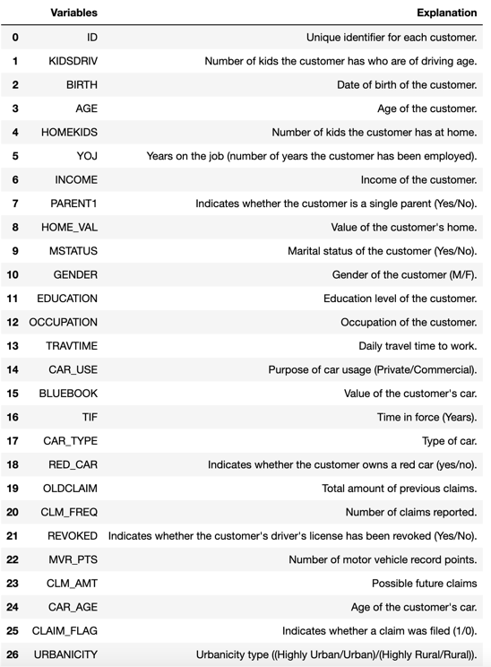
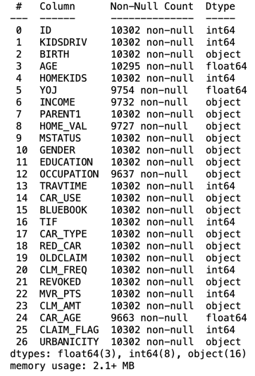
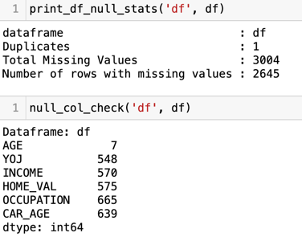
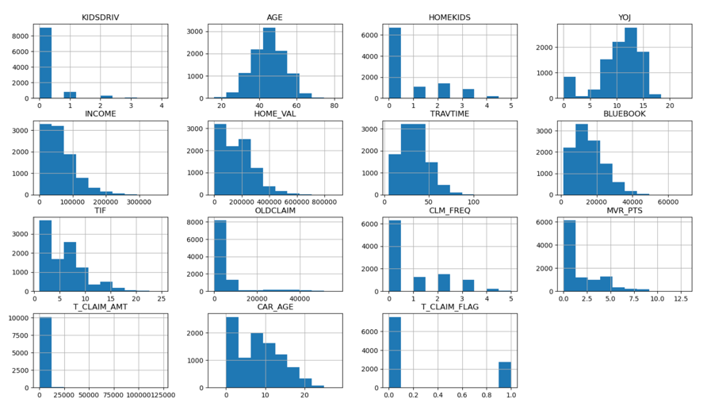
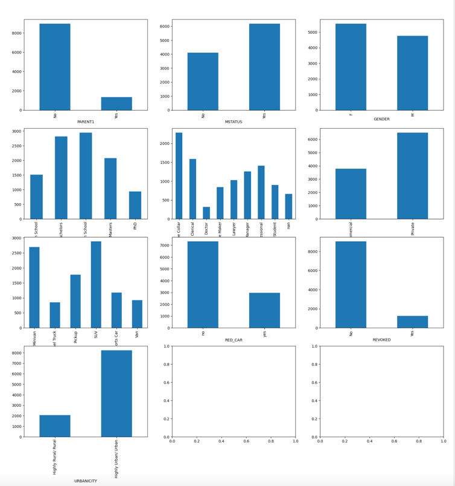
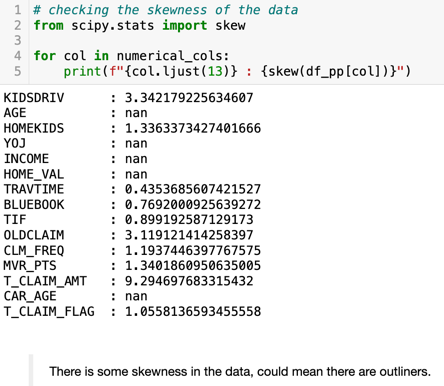

# Datasheet 

As far as you can, complete the model datasheet. If you have got the data from the internet, you may not have all the information you need, but make sure you include all the information you do have. 

## Motivation

- For what purpose was the dataset created?
  - The objective of the dataset is to predict whether or not a claim has occured for given data set, based on certain diagnostic measurements included in the dataset. 
- Who created the dataset (e.g., which team, research group) and on behalf of which entity (e.g., company, institution, organization)? Who funded the creation of the dataset?
  - From the online page it seem an invidiual has uploaded the data set into Kaggle. The web page does not provide any details of how this data was sourced. 

 
## Composition

- What do the instances that comprise the dataset represent (e.g., documents, photos, people, countries)? Please provide details.
  - Data contain 10302 rows and 27 columns.
  
  

- How many instances of each type are in total?
  - There are missing data. Below screenshot provides the each filed instance.
  
  
  
- Is there any missing data?
  - There are missing data.
  
  
  
- Does the dataset contain data that might be considered confidential (e.g., data that is protected by legal privilege or by    doctor–patient confidentiality, data that includes the content of individuals’ non-public communications)?
  - There is no confidential information in the as no individual can be identified in teh given data.

## Collection process

- How was the data acquired? 
  - There is no information how data  
- If the data is a sample of a larger subset, what was the sampling strategy?
  - N/A
- Over what time frame was the data collected?
  - N/A

## Preprocessing/cleaning/labelling

- Was any preprocessing/cleaning/labeling of the data done (e.g., discretization or bucketing, tokenization, part-of-speech tagging, SIFT feature extraction, removal of instances, processing of missing values)? If so, please provide a description. If not, you may skip the remaining questions in this section. 
  - Yes data preprocessing was required as data has missing value
    - There was duplicate row which was removed
    - Currency Columns ['INCOME','HOME_VAL','BLUEBOOK','OLDCLAIM','CLM_AMT'] were converted to float
    - Some columns ['MSTATUS', 'GENDER', 'EDUCATION', 'OCCUPATION', 'CAR_TYPE','URBANICITY'] have prefix z_, prefix was removed
    - Binary columns ['PARENT1', 'MSTATUS', 'GENDER', 'CAR_USE', 'RED_CAR', 'REVOKED', 'URBANICITY'] were updated to have 1 or 0
    - Education was mapped to ordinal encoding
    - categorical variable ['OCCUPATION','CAR_TYPE'] were Converted into dummy/indicator variables
    - Null columns were impyted using mean value,
- Was the “raw” data saved in addition to the preprocessed/cleaned/labeled data (e.g., to support unanticipated future uses)?
  - yes, raw file is not modified and can fowund in /data folder of this project
 
## Uses

- What other tasks could the dataset be used for?
  - Learning Purpose
- Is there anything about the composition of the dataset or the way it was collected and preprocessed/cleaned/labeled that might impact future uses? For example, is there anything that a dataset consumer might need to know to avoid uses that could result in unfair treatment of individuals or groups (e.g., stereotyping, quality of service issues) or other risks or harms (e.g., legal risks, financial harms)? If so, please provide a description. Is there anything a dataset consumer could do to mitigate these risks or harms?
  - No
- Are there tasks for which the dataset should not be used? If so, please provide a description.
  - can be used to predict the claim status for any insurance company

## Distribution

- How has the dataset already been distributed?
  - data was skwed
  
  

  

  

- Is it subject to any copyright or other intellectual property (IP) license, and/or under applicable terms of use (ToU)?
  - Nothing mentioned on the web page

## Maintenance

- Who maintains the dataset?
  - N/A

